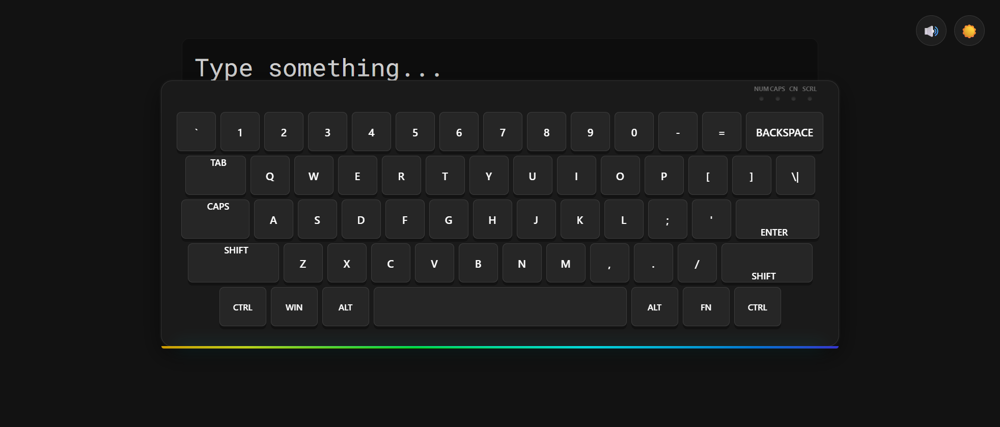
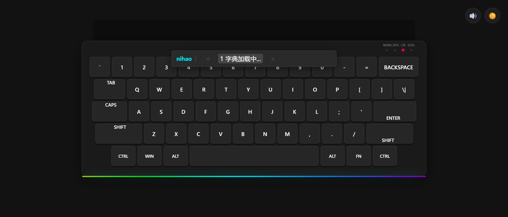
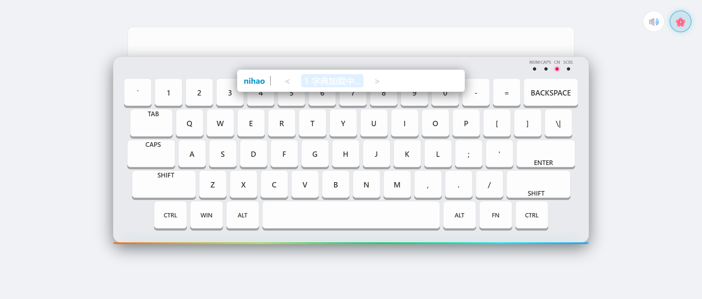

# Cyber Virtual Keyboard

一个赛博风格的浏览器虚拟键盘，支持英文输入、中文拼音候选、主题切换和机械感按键音效。


## 在线体验

- Demo: https://huahai0202.github.io/virtual-keyboard/

## 截图预览

### 默认界面



### 拼音候选输入



### 主题切换



## 核心功能

- 中英文模式切换：按 `Shift`（单独点击）切换，`CN` 指示灯同步显示
- 拼音候选输入：支持完整拼音、首字母匹配、部分模糊匹配
- 候选选择与翻页：`1-9` 选词，`Space` 选首项，`-`/`[` 上翻，`=`/`]` 下翻
- 中文标点映射：如 `, -> ，`、`. -> 。`、`? -> ？`
- 音效开关：基于 Web Audio API 的机械键盘点击音
- 主题切换：默认赛博、亮色、樱花粉、森林绿、海洋蓝
- 物理键盘和鼠标点击都可用，移动端也可访问

## 快速开始

本项目是纯前端静态页面，但字典通过 `fetch` 加载，需使用本地 HTTP 服务运行。

```bash
# 方式 1: Node
npx serve -l 3000

# 方式 2: Python
python -m http.server 3000
```

打开 `http://localhost:3000`。

## 使用说明

### 英文输入

- 直接输入字符，支持 `Backspace`、`Enter`、`Tab`
- `CapsLock` 状态会同步到键盘面板指示灯

### 中文输入

1. 按 `Shift` 切换到中文模式
2. 输入拼音（例如 `nihao`、`zhifubao`）
3. 查看候选栏并按 `1-9` 选择，或按 `Space` 选第一项
4. 按 `Enter` 可直接提交当前拼音字符串

### 快捷键

- `Ctrl+A` 全选输出区文本
- `Ctrl+C` 复制输出区文本
- `Ctrl+V` 粘贴剪贴板文本

## 技术实现

- `index.html`：页面结构与字典预加载
- `style.css`：赛博风格 UI、主题与响应式布局
- `script.js`：输入状态机、候选框渲染、键盘事件、音效与主题切换
- `pinyinMatch.js`：拼音匹配算法（前缀/首字母/子序列）
- `pinyin-char-dict.json`：单字拼音字典
- `pinyin-phrase-dict.json`：词组拼音字典

## 数据说明

- `pinyin-char-dict.json`：约 408 个拼音键
- `pinyin-phrase-dict.json`：约 120000 个词组拼音键（脚本生成）
- 词组字典构建脚本：`scripts/build_phrase_dict.py`

## 项目结构

```text
.
├── index.html
├── style.css
├── script.js
├── pinyinMatch.js
├── pinyin-char-dict.json
├── pinyin-phrase-dict.json
├── scripts/
│   └── build_phrase_dict.py
└── README.md
```

## License

MIT
